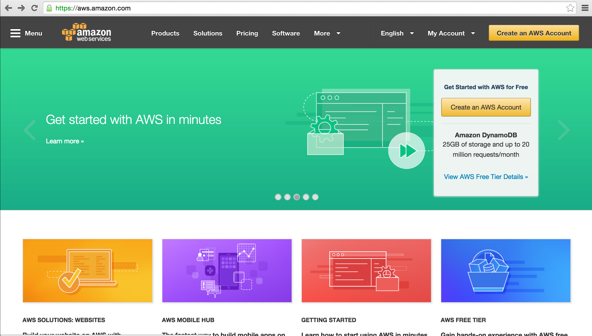
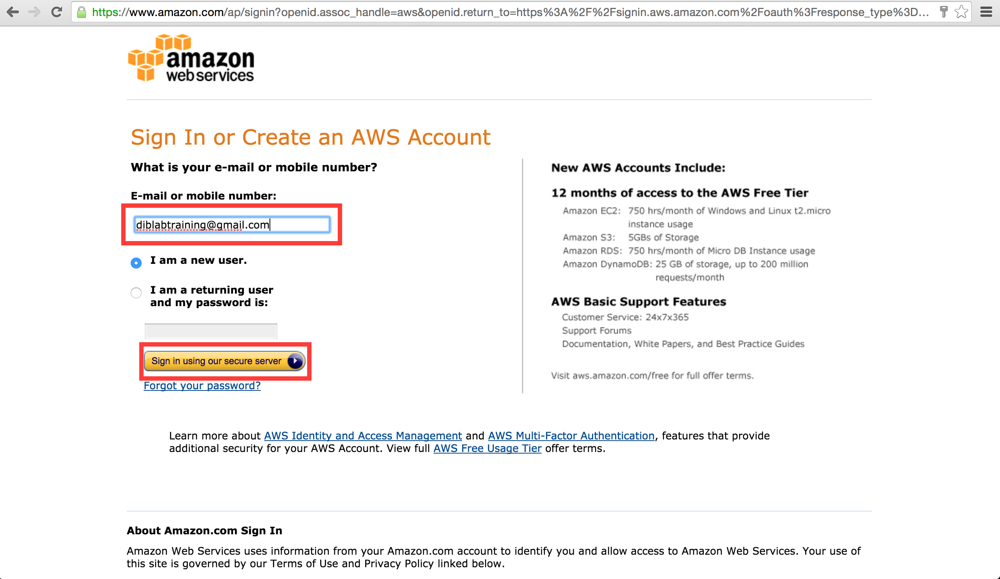
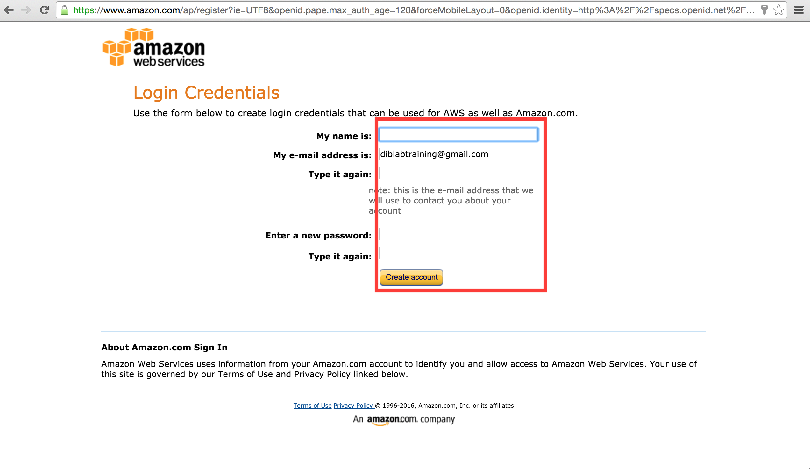
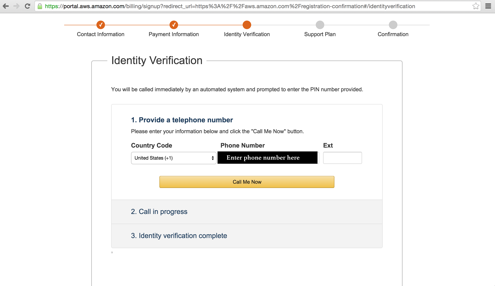
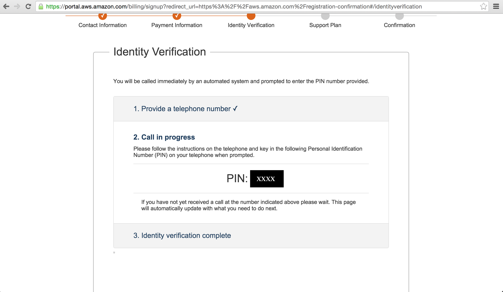
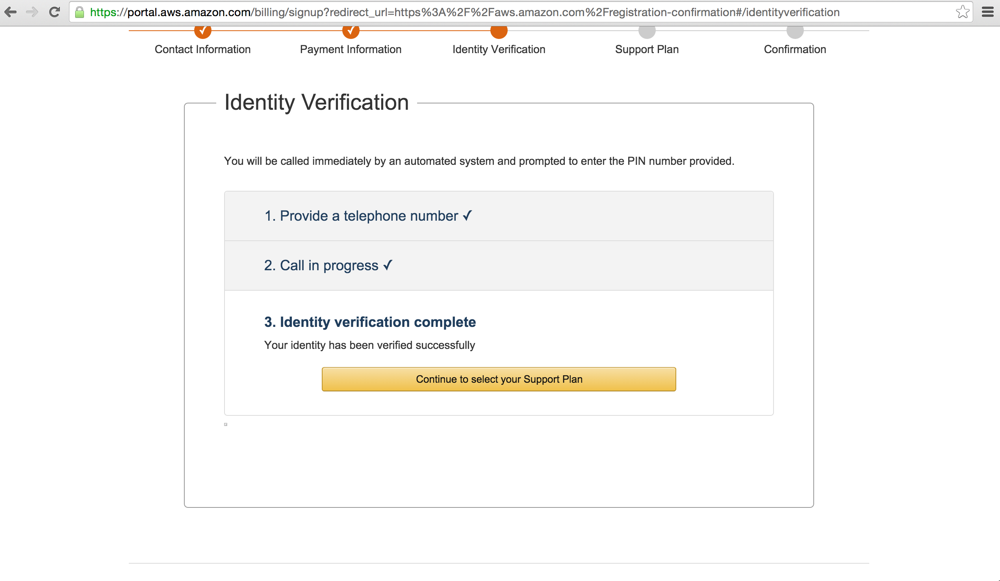
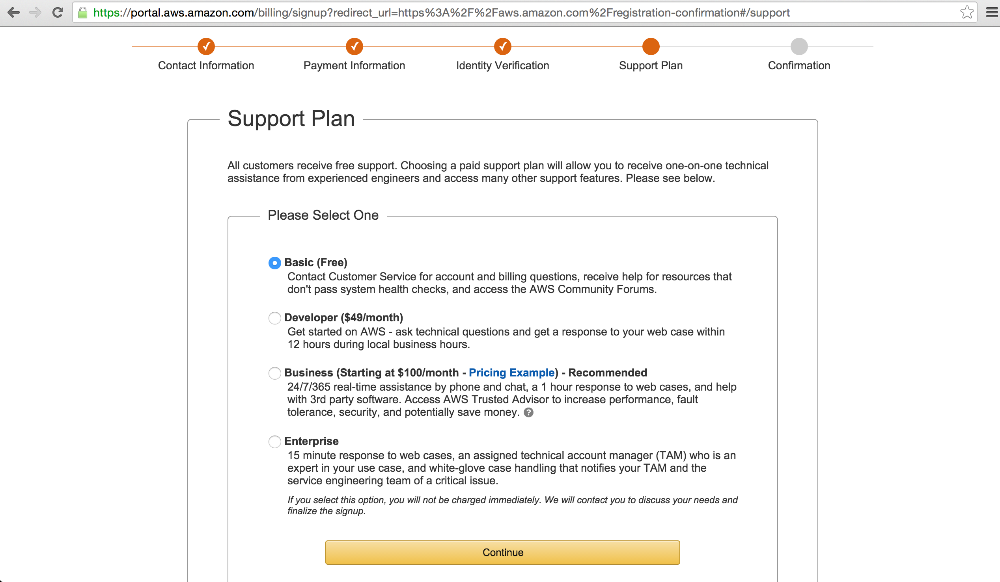
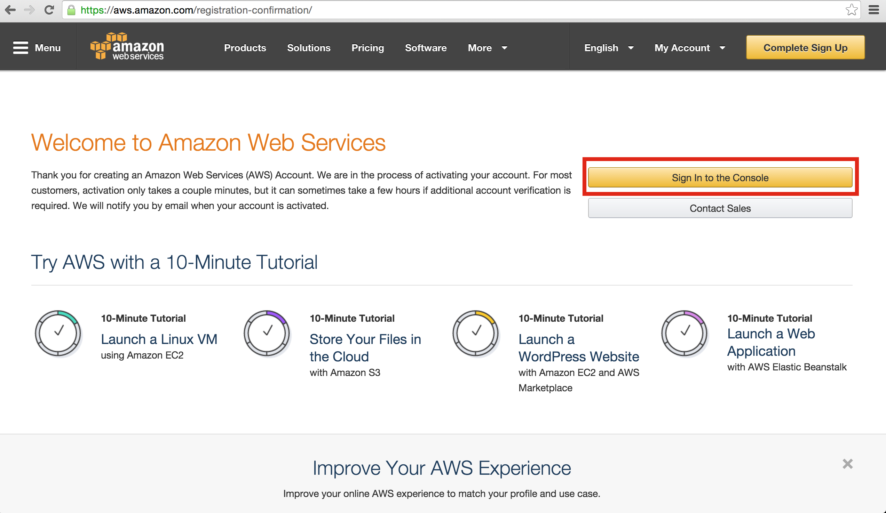
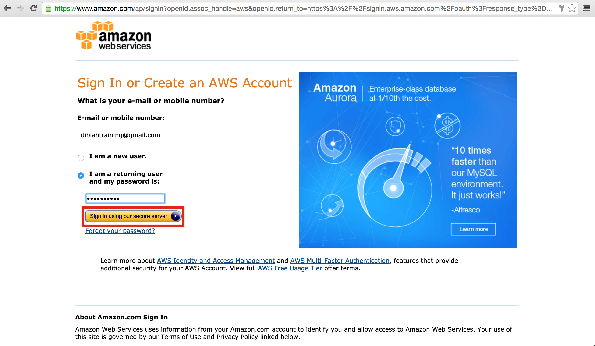

=================================================
So You Want to (or Need to) Create an AWS Account
=================================================

This page will take you through the creating of an Amazon Web Services account.
In addition to a computer, you'll need a phone to receive a call, and a credit 
card to charge for computing costs. (Generally this is meager, less than $5 
for a workshop).

Go to `http://aws.amazon.com/ <http://aws.amazon.com/>`__, and click on "Create an AWS account".
You'll notice that there are two buttons that say this, make sure you choose the correct one or 
nothing will work. (Just kidding, they are both the same. Not sure why Amazon made two).

Now click "I am a new user", enter the email are signing up with, and click "Sign in Using our secure server".

Fill in your name, choose a password.

Fill in this information affiliated with the credit card you will be using after chosing "Personal Account".
Your security check will be different that the image here.

.. image:: aws-screenshots/aws-signup-4.png
   :width: 60%

Enter your credit card information here, making sure the affiliated address is correct for the card.

.. image:: aws-screenshots/aws-signup-5.png
   :width: 60%

Now comes the phone verification step to ensure you are real person with a phone! Enter your phone number.

During the call, you will see a PIN where "xxxx" is on the image below. The call will prompt you to enter 
it on your phone keypad.

If successful, you will get this screen on your computer. Click "Continue to select your Support Plan". 

Choose the basic plan. You will only be charged for computer use.

You should return to this page. Click "Sign In to the Console"

Enter your shiny new password to access your account.

If you see this icon rich page, congratulations, you've successfully made your account!

.. image:: aws-screenshots/aws-signup-12.png
   :width: 60%
